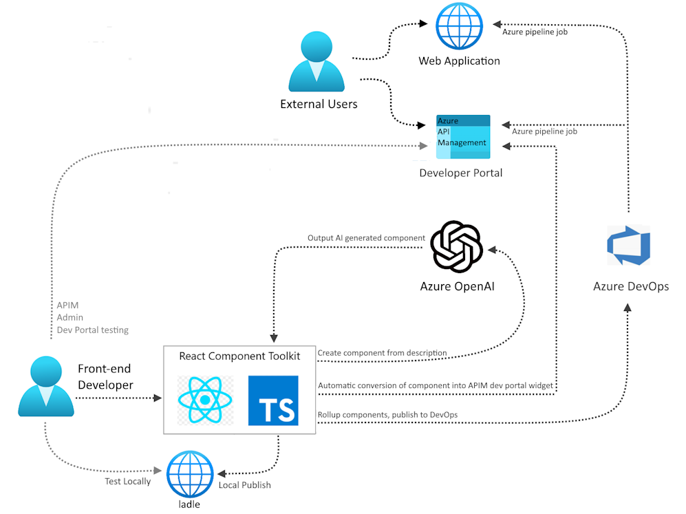

<!-- YAML front-matter schema: https://review.learn.microsoft.com/en-us/help/contribute/samples/process/onboarding?branch=main#supported-metadata-fields-for-readmemd -->

# React Component Toolkit with ChatGPT and Azure OpenAI

The [React Component Toolkit](https://github.com/microsoft/react-component-toolkit#install-via-azdev) is a toolkit for building and testing react components and includes a set of unique features including AI component generation and automatic conversion to Azure APIM Widgets. This samples provides auto-provisioning of necessary Azure resources and an interactive process of utilizing the toolkit.

## Features

This project framework provides the following features:

* Integrates with Azure OpenAI allowing the creation of components from a description alone.
* Can convert a react component into an Azure API Management Widget.
* Can be tested standalone using ladle which is built into the toolkit stack.
* Includes a few example components including a markdown viewer, force-graph-3d component, etc.
* Automatically adds dependencies for created components.
* Uses css as code through Styled Components out of the box.

## Getting Started
> **IMPORTANT:** In order to deploy and run this example, you'll need an **Azure subscription with access enabled for the Azure OpenAI service**. You can request access [here](https://aka.ms/oaiapply). You can also visit [here](https://azure.microsoft.com/free/cognitive-search/) to get some free Azure credits to get you started.

### Prerequisites

#### To Run Locally
- [Azure Developer CLI](https://aka.ms/azure-dev/install)
- [Node.js](https://nodejs.org/en/download/)
- [Git](https://git-scm.com/downloads)
- [Powershell 7+ (pwsh)](https://github.com/powershell/powershell) 
   - **Important**: Ensure you can run `pwsh.exe` from a PowerShell command. If this fails, you likely need to upgrade PowerShell.

>NOTE: Your Azure Account must have `Microsoft.Authorization/roleAssignments/write` permissions, such as [User Access Administrator](https://learn.microsoft.com/azure/role-based-access-control/built-in-roles#user-access-administrator) or [Owner](https://learn.microsoft.com/azure/role-based-access-control/built-in-roles#owner).  

### Quickstart
1. git clone https://github.com/Azure-Samples/react-component-toolkit-openai-demo.git 
1. cd react-component-toolkit-openai-demo
1. Run `azd auth login`
1. Run `azd up` - This will provision Azure resources in your specified azd environment.
> NOTE: For the target location, the regions that currently support the models used in this sample are **East US**, **South Central US**, or **West Europe** For an up-to-date list of regions and models, check [here](https://learn.microsoft.com/en-us/azure/cognitive-services/openai/concepts/models). It may take a minute for the services to be provisioned and te application to be fully deployed.

1. After the services have been successfully provisioned, a post-provision script would automatically execute doing the following:
    * the react-component-toolkit would be cloned locally
    * you would be able to follow the prompts in console and interact with the local toolkit to generate new react components (for full documentation on the react component toolkit, refer to [here](https://github.com/microsoft/react-component-toolkit)) 

## Resources

* [Revolutionize your Enterprise Data with ChatGPT: Next-gen Apps w/ Azure OpenAI and Cognitive Search](https://aka.ms/entgptsearchblog)
* [Azure Cognitive Search](https://learn.microsoft.com/azure/search/search-what-is-azure-search)
* [Azure OpenAI Service](https://learn.microsoft.com/azure/cognitive-services/openai/overview)
